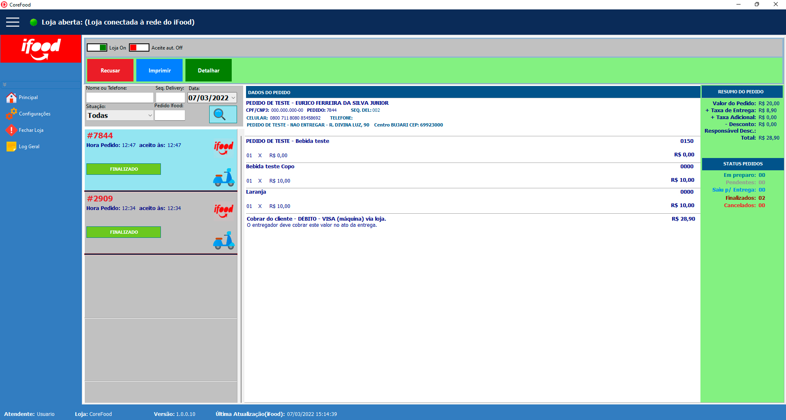
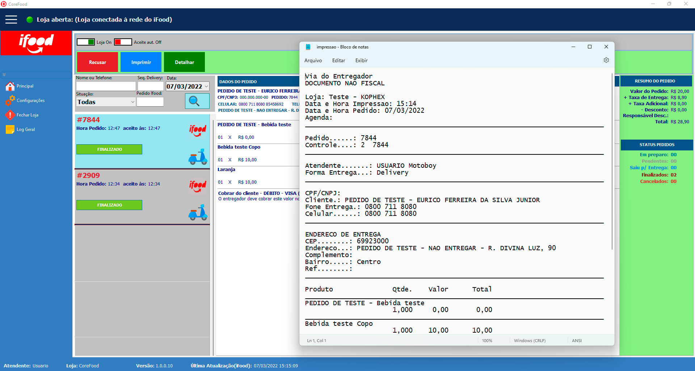
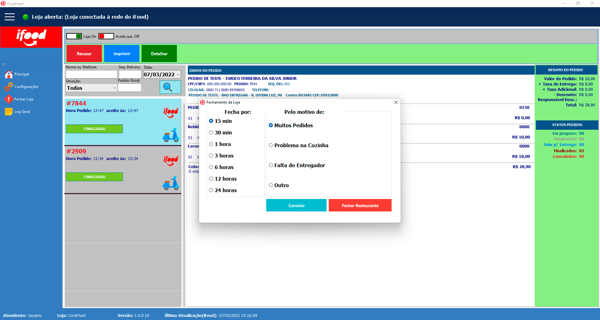
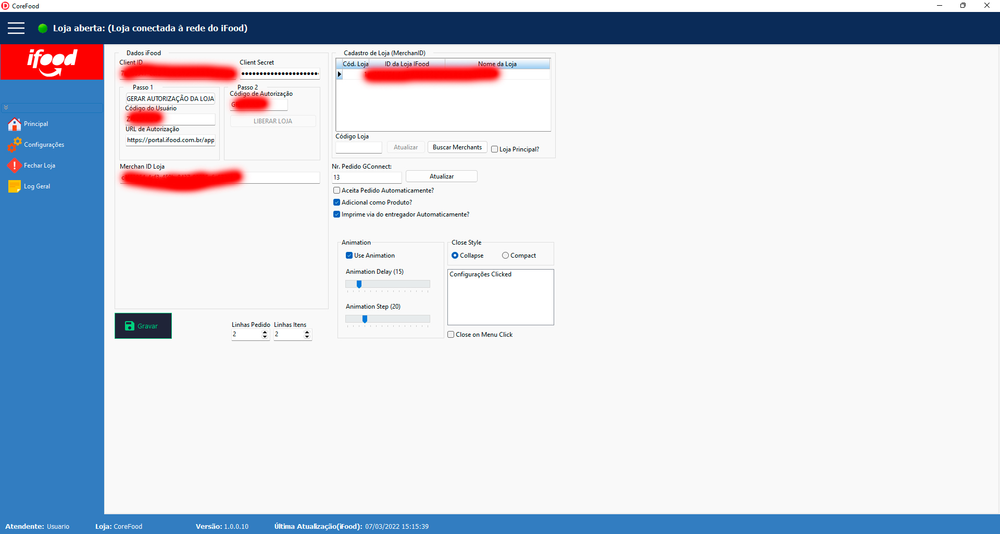
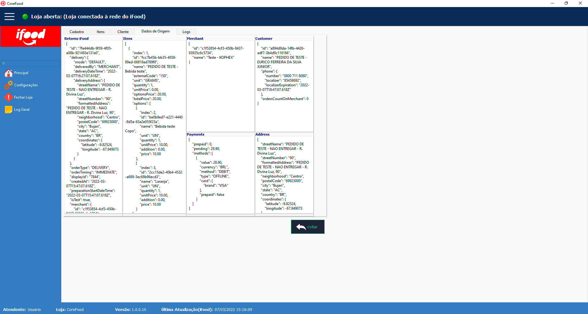
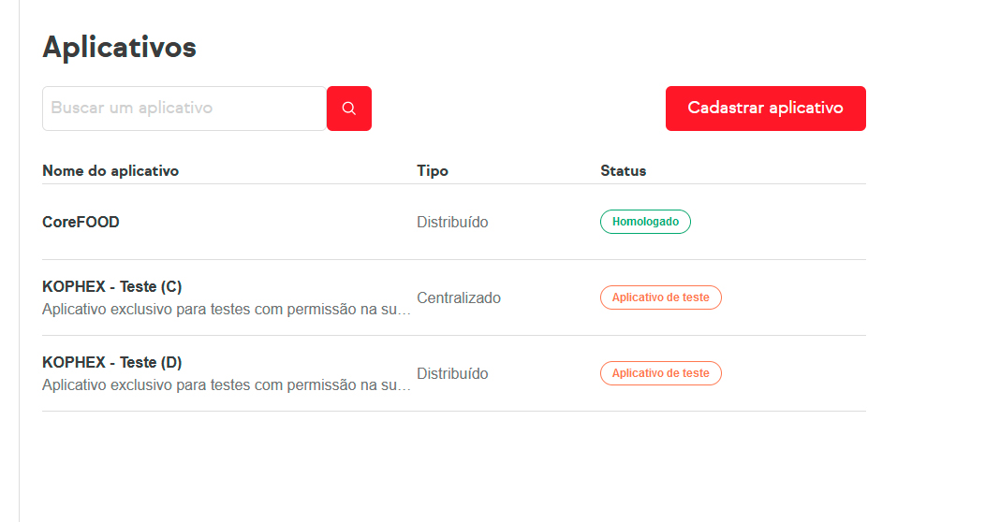

# Gestor iFood em Delphi

Sistema de integração e gestão de pedidos do iFood desenvolvido em Delphi.

## Recursos

- Recebimento e despacho de pedidos
- Agendamento de pedidos para entrega
- Agendamento e entrega de pedidos na mesa
- Recusa de pedidos
- Pausa da loja
- Aceite automático de pedidos
- Impressão de pedidos
- Detalhamento completo dos pedidos

## Tecnologias

- Delphi
- Firebird 2.5 e 3.0
- API do iFood

## Imagens

## Configuração

Copie `src/pasta/IFOODConfig.example.ini` para `src/pasta/IFOODConfig.ini` e informe suas próprias credenciais da API e do banco de dados. Não publique esse arquivo preenchido.

## Aviso

Este é um projeto independente. iFood é uma marca de seus respectivos proprietários. Credenciais, tokens e códigos de autorização não estão incluídos no repositório.
